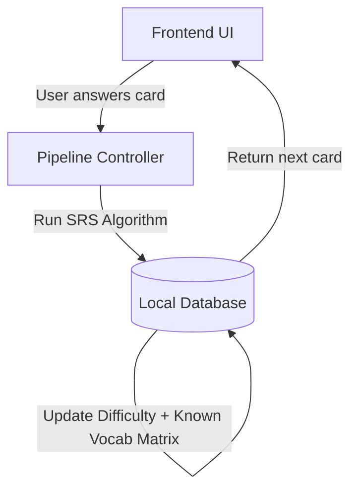

# Tars - Chinese Language Learning App

## Project Overview

Tars is an immersive Chinese language learning application that combines SRS flashcards, voice-driven roleplay, and precision shadowing drills. The core loop: learn vocabulary via flashcards, then practice them in AI-generated roleplay scenarios that force usage of difficult words/grammar, with real-time tone feedback.

## Architecture

**Monorepo** with two independent applications:

```
tars/
├── AGENTS.md                 # This file - project context
├── opencode.json             # opencode configuration
├── README.md                 # Project readme
├── pyproject.toml            # Python project config
├── .gitignore
├── .python-version
├── uv.lock
├── app/
│   └── api/
│       └── CONTRACTS.md      # API endpoint contracts
├── backend/
│   ├── app/                  # FastAPI Python server (future)
│   ├── seed_data/            # HSK starter deck data (future)
│   └── tests/                # pytest tests (future)
├── mobile/                   # React Native Expo app (future)
├── shared/
│   └── assets/
│       └── audio/            # Reference audio for shadowing (future)
└── tests/                    # Integration tests (future)
```

## System Components

| Component | Location | Role |
|-----------|----------|------|
| **Frontend UI** | `mobile/` | React Native Expo. Handles mic input, audio playback, flashcard rendering |
| **Pipeline Controller** | `backend/app/` | Core backend router. Orchestrates data flow, decides module states (dormant/pre-warmed), coordinates AI workers |
| **Audio Analytics Module** | `backend/app/` | pYIN pitch extraction + DTW alignment for shadowing evaluation |
| **Sync Engine** | `backend/app/` + `mobile/` | Manages bidirectional data sync between local and backend SQLite databases |
| **External AI Services** | Cloud APIs | STT (Groq), LLM (DeepSeek-V3), TTS (Edge-TTS/Deepgram) |
| **Local Audio Engine** | `mobile/` | Silero VAD for silence detection, audio recording buffers |
| **Database** | `mobile/` (primary) + `backend/` (mirror) | SQLite via SQLModel. Flashcard review is local-only |

## Technology Stack

| Layer | Technology | Purpose |
|-------|-----------|---------|
| Frontend | React Native + Expo | Cross-platform mobile UI |
| State | Zustand | Client-side state management |
| Backend | FastAPI (Python 3.14+) | API server, pipeline controller |
| Database | SQLite via SQLModel | SRS data, flashcards, session logs |
| STT | Groq Whisper | Speech-to-text transcription |
| LLM | DeepSeek-V3 | Roleplay engine, grammar validation |
| TTS | Edge-TTS (primary) / Deepgram (fallback) | Mandarin audio generation |
| Local Audio | Silero VAD + Librosa | Voice detection + pitch analysis |
| Package Mgr | uv (Python) / npm (mobile) | Dependency management |
| Testing | pytest (backend) / Jest (mobile) | Minimal test coverage |

## Key Design Decisions

### Single-User Mode
- No login system. Hardcoded default user profile.
- All data belongs to one local user. No multi-tenancy.

### Hybrid Local/Backend Split
- **Flashcard review is local-only** - runs entirely on device, no backend needed
- **Backend mirrors flashcard DB** - for sync/backup and roleplay/shadowing features
- **Roleplay + Shadowing require backend** - LLM, TTS, and audio analysis run server-side

### Database Sync Strategy
- Two SQLite databases: one on mobile (primary), one on backend (mirror)
- **Mobile-wins conflict resolution** - local changes always overwrite backend
- **Sync timing**: on session end + on app open
- SyncLog tracks what's been synced between devices

### Audio Pipeline (Hybrid Split)
- **Local (on-device)**: Silero VAD (silence detection), audio recording buffers
- **Backend**: pYIN pitch extraction, DTW alignment, tone scoring
- **Cloud**: STT (Groq), TTS (Edge-TTS/Deepgram), LLM (DeepSeek)

### Offline Strategy
- When network drops: flashcard-only mode with local SRS
- Roleplay and voice features require network
- Graceful degradation, no crashes

### TTS Fallback
- Edge-TTS is default (free, fast, good Mandarin)
- Deepgram as premium fallback (higher quality)
- Backend selects provider based on config/availability

### Shadowing Audio Assets
- Native reference audio files bundled in both mobile and backend (`shared/assets/audio/`)
- Pre-calculated pitch contours cached in database on ingestion
- Files referenced by path string, not binary blobs

### Hint Delivery
- Hints delivered via WebSocket events during active roleplay sessions
- Client sends `{"event_type": "request_hint"}`, server responds with `hint_response`

### Scenario Source
- Pre-defined roleplay scenarios stored in database
- User selects from list, not AI-generated on the fly

## Database Schema (SQLModel)

### Entity 1: Flashcard (Core Vocabulary Repository)

Primary lexicon deck. Holds core dictionary definitions.

| Column | Type | Constraints | Description |
|--------|------|-------------|-------------|
| `id` | UUID | PK | Unique identifier |
| `character` | VARCHAR | indexed | Chinese hanzi (e.g., "得", "咖啡") |
| `pinyin` | VARCHAR | | Dictionary pronunciation (e.g., "de", "kāfēi") |
| `meaning` | TEXT | | English translation or grammatical definition |
| `grammar_type` | VARCHAR | indexed | Category: "particle", "verb", "noun", "adjective", etc. |
| `created_at` | TIMESTAMP | | Creation timestamp |

### Entity 2: User_Vocabulary_State (Mastery Tracker)

Known Vocabulary Profile and Difficulty Matrix. Tracks personal computational memory loop per card.

| Column | Type | Constraints | Description |
|--------|------|-------------|-------------|
| `id` | UUID | PK | Unique identifier |
| `flashcard_id` | UUID | FK -> Flashcard.id, unique, indexed | One state per card |
| `srs_interval` | INTEGER | default 0 | Days until next review |
| `ease_factor` | FLOAT | default 2.5 | Internal SRS spacing modifier |
| `total_reviews` | INTEGER | default 0 | Total interactions with this card |
| `total_failures` | INTEGER | default 0 | Total misses or failed constraints |
| `difficulty_score` | FLOAT | default 0.0, indexed | 0.0-1.0 difficulty rating |

### Entity 3: Scenario (Roleplay Contexts)

Pre-defined roleplay scenario templates.

| Column | Type | Constraints | Description |
|--------|------|-------------|-------------|
| `id` | UUID | PK | Unique identifier |
| `title` | VARCHAR | indexed | Scenario name (e.g., "Ordering Food") |
| `description` | TEXT | | Scene context for LLM |
| `difficulty` | VARCHAR | indexed | "beginner", "intermediate", "advanced" |
| `target_grammar` | TEXT | | JSON array of grammar tokens (e.g., '["把", "了", "要"]') |
| `example_prompt` | VARCHAR | optional | Opening line for the scenario |
| `created_at` | TIMESTAMP | | Creation timestamp |

### Entity 4: Roleplay_Session (Conversation Hub)

Tracks every roleplay session instance.

| Column | Type | Constraints | Description |
|--------|------|-------------|-------------|
| `id` | UUID | PK | Unique identifier |
| `scenario_id` | UUID | FK -> Scenario.id, indexed | Linked scenario |
| `started_at` | TIMESTAMP | | Session start time |
| `ended_at` | TIMESTAMP | nullable | Session end time |

### Entity 5: Chat_Log (Interaction Feed)

Line-by-line message saves. Crash-resilient session memory.

| Column | Type | Constraints | Description |
|--------|------|-------------|-------------|
| `id` | UUID | PK | Unique identifier |
| `session_id` | UUID | FK -> Roleplay_Session.id, indexed | Parent session |
| `timestamp` | TIMESTAMP | | Message timestamp |
| `sender` | VARCHAR | | "user" or "tars" |
| `text_content` | TEXT | | Chinese message string |

### Entity 6: Turn_Evaluation (Grammar Validation Log)

Per-turn validation analytics for grammar constraint checking.

| Column | Type | Constraints | Description |
|--------|------|-------------|-------------|
| `id` | UUID | PK | Unique identifier |
| `chat_log_id` | UUID | FK -> Chat_Log.id, indexed | Parent chat message |
| `target_flashcard_id` | UUID | FK -> Flashcard.id, indexed | Forced token for this turn |
| `grammar_passed` | BOOLEAN | | Did user use target structure correctly? |

### Entity 7: Shadowing_Media (Reference Audio)

Native reference audio paths and cached pitch contours.

| Column | Type | Constraints | Description |
|--------|------|-------------|-------------|
| `id` | UUID | PK | Unique identifier |
| `flashcard_id` | UUID | FK -> Flashcard.id, indexed | Linked vocabulary card |
| `audio_file_path` | VARCHAR | | Path to native audio file |
| `native_pitch_contour` | TEXT | | JSON array of pre-calculated pitch floats |

### Entity 8: Shadowing_Attempt (Phonetic Score Log)

User's pitch match scores over time using DTW alignment.

| Column | Type | Constraints | Description |
|--------|------|-------------|-------------|
| `id` | UUID | PK | Unique identifier |
| `shadowing_media_id` | UUID | FK -> Shadowing_Media.id, indexed | Reference audio |
| `pitch_match_score` | FLOAT | | 0.0-1.0 similarity score |
| `user_pitch_curve` | TEXT | nullable | JSON array of user's pitch values |
| `completed_at` | TIMESTAMP | | Attempt timestamp |

### Entity 9: SyncLog (Sync Tracker)

Tracks synchronization between mobile and backend databases.

| Column | Type | Constraints | Description |
|--------|------|-------------|-------------|
| `id` | UUID | PK | Unique identifier |
| `direction` | VARCHAR | | "push" or "pull" |
| `synced_at` | TIMESTAMP | | Sync timestamp |
| `flashcards_upserted` | INTEGER | default 0 | Number of flashcards synced |
| `states_upserted` | INTEGER | default 0 | Number of vocabulary states synced |
| `last_sync_at` | TIMESTAMP | nullable | Client's timestamp before this sync |

### Entity Relationships

```
Flashcard 1:1 User_Vocabulary_State
Flashcard 1:N Shadowing_Media
Flashcard 1:N Turn_Evaluation (via target_flashcard_id)

Roleplay_Session 1:N Chat_Log
Roleplay_Session N:1 Scenario

Chat_Log 1:N Turn_Evaluation

Shadowing_Media 1:N Shadowing_Attempt
```

### SRS Algorithm

- **Custom difficulty-score-driven** algorithm (not SM-2 or FSRS)
- Difficulty score (0.0-1.0) calculated from: correct/incorrect ratio, response time, consecutive failures
- Top N high-difficulty tokens pulled for roleplay injection
- Progressive introduction rate controlled by `i+1` theory

## Workflows

### Workflow A: Flashcard Review (Local, Data-Intensive)



1. User marks card as "easy", "good", or "hard" on Frontend UI
2. Pipeline Controller calculates new interval and difficulty metrics locally
3. Metrics written immediately to Local Database (crash resilience)
4. Next scheduled card pulled from database, screen updates
5. Entire process takes < 10ms

### Workflow B.1: Roleplay Session (Fluency + Grammar)

```mermaid
sequenceDiagram
    autonumber
    participant UI as Frontend UI
    participant PC as Pipeline Controller
    participant DB as Local DB
    participant AI as AI Cloud API

    Phase 1: Pre-Warming
    UI->>PC: Tap Roleplay Menu
    PC->>DB: Query Profile (Allowed words, targeted grammar tokens)
    DB-->>PC: Return User Vocab Profile Matrix
    PC->>AI: Pre-warm Open Handshake (Open WebSocket Stream)
    AI-->>PC: Connection Ready
    PC-->>UI: UI Mic Ready (Transition UI state)

    Phase 2: The Conversational Turn
    UI->>PC: Stream User Audio Chunk (Silero VAD captures speech end)
    PC->>AI: Forward Live Audio Stream to STT
    AI-->>PC: Return Transcribed Chinese Text String

    Phase 3: Grammar Checks & Output Generation
    Note over PC: Run Grammar Constraint Validation
    PC->>AI: Send Text + Constraints (Evaluation status + Word ceiling rule)
    AI-->>PC: Stream Response Text & Audio Buffer Bytes
    PC-->>UI: Play Balanced Audio Stream Immediately

    Phase 4: Async Save Loop
    PC->>DB: Async Background Save (Write text turn log to Chat_Log & Turn_Evaluation)
```

**Phase 1: Pre-Warming**
1. User taps roleplay menu
2. Pipeline Controller queries user's vocabulary profile (allowed words, targeted grammar tokens) from DB
3. Pipeline Controller opens WebSocket handshake with AI Cloud API
4. Connection ready, UI transitions to mic-ready state

**Phase 2: The Conversational Turn**
5. User speaks, Silero VAD captures speech end locally
6. Audio stream forwarded to Groq STT
7. Transcribed Chinese text string returned

**Phase 3: Grammar Checks & Output Generation**
8. Pipeline Controller runs grammar constraint validation locally
9. Text + constraints + word ceiling rule sent to DeepSeek
10. Response text and audio buffer streamed back
11. Audio played immediately (no wait for full response)

**Phase 4: Async Save Loop**
12. Background async save writes turn log to Chat_Log and Turn_Evaluation
13. Repeat from Phase 2 for next conversational turn
14. On session end: batched SRS analytics committed to DB

### Workflow B.2: Shadowing Drill (Phonetic Precision)

```mermaid
sequenceDiagram
    autonumber
    participant UI as Frontend UI
    participant PC as Pipeline Controller
    participant DB as Local DB

    Phase 1: Material Loading
    UI->>PC: Open Shadowing Drills / Select Failing Word
    PC->>DB: Fetch Shadowing_Media (Audio path + native_pitch_contour)
    DB-->>PC: Return Reference Media Metadata Payload
    PC-->>UI: Populate Player & Load Audio Stream Assets

    Phase 2: Listening & Recording
    UI->>UI: Play Native Speaker Audio Clip
    UI->>PC: User Records Shadowing Attempt (.wav / .ogg)

    Phase 3: Mathematical Pitch Alignment
    PC->>PC: Execute Librosa Pipeline
    Note over PC: 1. pYIN frequency extraction
    Note over PC: 2. Normalize pitch range
    Note over PC: 3. DTW alignment vs native contour

    Phase 4: Score Compilation & Persistence
    PC-->>UI: Return pitch_match_score (Render graph overlap)
    PC->>DB: Save Shadowing_Attempt (Commit score to DB)
```

**Phase 1: Material Loading**
1. User opens shadowing drills, selects a failing word
2. Pipeline Controller fetches Shadowing_Media from DB (audio path + cached native_pitch_contour array)
3. Reference media metadata returned, player populated with audio stream assets

**Phase 2: Listening & Recording**
4. Native speaker audio clip plays for user to listen
5. User records their shadowing attempt (.wav / .ogg)

**Phase 3: Mathematical Pitch Alignment**
6. Pipeline Controller executes Librosa processing pipeline:
   - Extract user frequency profile via pYIN
   - Normalize pitch range relative to user baseline
   - Run Dynamic Time Warping (DTW) vs native contour template

**Phase 4: Score Compilation & Persistence**
7. pitch_match_score (0.0-1.0) returned to UI
8. UI renders visual graph overlap comparing user vs native pitch contour
9. Shadowing_Attempt saved to DB (adjusts overall card weight)

## Roleplay Engine Pipeline

1. **Pre-warm connection**: Open WebSocket handshake with AI before mic engages (eliminates handshake lag)
2. **Select targets**: Pull user's top N high-difficulty flashcards + vocabulary profile
3. **Generate scenario**: Create context that forces target vocabulary
4. **Enforce constraints**: LLM prompt includes mandatory vocabulary/grammar + word ceiling rule
5. **Validate response**: Check if user used target structures correctly
6. **Correct in-character**: If validation fails, provide natural correction without breaking immersion
7. **Adaptive scaling**: Adjust scenario complexity based on real-time difficulty metrics
8. **Async save**: Background write of chat logs and evaluations (crash resilience)

### LLM Prompt Isolation (NFR-2.2)
- System instructions separated from user inputs
- User transcriptions treated as data, never as instructions
- Pipeline controller sanitizes all inputs before LLM calls

## Functional Requirements Summary

| ID | Requirement | Module |
|----|-------------|--------|
| FR-2.1 | CRUD vocabulary deck | Flashcards |
| FR-2.2 | Difficulty Analytics Engine | SRS |
| FR-2.3 | Identify top N failing tokens | SRS |
| FR-3.1 | Speech-to-Text (Groq Whisper) | Voice |
| FR-3.2 | Text-to-Speech (Edge-TTS/Deepgram) | Voice |
| FR-4.1 | Targeted injection of difficult tokens | Roleplay |
| FR-4.2 | Pre-defined scenario generation | Roleplay |
| FR-4.3 | Mandarin-only enforcement | Roleplay |
| FR-4.4 | Grammar constraint validation | Roleplay |
| FR-4.5 | In-character correction | Roleplay |
| FR-4.6 | Proactive scaffolding hints (WebSocket) | Roleplay |
| FR-4.7 | Adaptive scenario scaling | Roleplay |
| FR-5.1 | Known-Vocabulary Ceiling | Progression |
| FR-5.2 | Progressive comprehensible input (i+1) | Progression |
| FR-5.3 | Dynamic correction handling | Progression |
| FR-6.1 | Asset path management (file pointers) | Shadowing |
| FR-6.2 | Pre-calculated reference contours | Shadowing |
| FR-6.3 | Phonetic drill selection | Shadowing |
| FR-6.4 | DTW alignment (Librosa) | Shadowing |
| FR-6.5 | Visual pitch feedback | Shadowing |

## Non-Functional Requirements Summary

| ID | Requirement | Target |
|----|-------------|--------|
| NFR-1.1 | Voice loop latency | < 2.5s end-to-end |
| NFR-1.2 | Local shadowing analysis | < 300ms |
| NFR-2.1 | Monolingual lock (Mandarin only) | Active sessions |
| NFR-2.2 | Prompt isolation | All LLM calls |
| NFR-3.1 | Immediate chat log writes | Crash resilience |
| NFR-3.1 | Batched SRS analytics | End session only |
| NFR-3.2 | Voice mode pre-warming | Before mic engage |
| NFR-3.3 | Offline fallback | Flashcard-only mode |

## Code Conventions

### Backend (Python)
- Python 3.14+
- Type hints everywhere
- SQLModel for ORM (Pydantic + SQLAlchemy hybrid)
- Async/await for all FastAPI endpoints
- Services layer contains business logic, not route handlers
- No print statements - use `logging` module
- Config via environment variables (pydantic-settings)

### Frontend (React Native)
- TypeScript strict mode
- Expo Router for navigation
- Zustand stores for state (one store per feature domain)
- Components are functional with hooks only
- No class components
- Styles use StyleSheet.create or NativeWind

### General
- No comments unless explaining non-obvious business logic
- Variable/function names must be self-documenting
- Keep functions small and focused (< 50 lines ideal)
- Error handling: explicit try/catch, no silent failures
- All user-facing text in Chinese during active sessions (NFR-2.1)

## Performance Targets

- **Voice loop latency**: < 2.5s end-to-end (STT -> LLM -> TTS)
- **Local shadowing analysis**: < 300ms after recording ends
- **Chat log persistence**: Immediate write to DB (crash resilience)
- **SRS analytics**: Batched commit on "End Session" only
- **Flashcard review**: < 10ms per card (local only)

## Development Commands

### Backend (Python + uv)
- Initialize virtual environment: `uv venv`
- Install dependencies: `uv sync`
- Run local server: `uv run uvicorn app.main:app --reload`
- Run backend tests: `uv run pytest`

### Mobile (React Native + Expo)
- Install dependencies: `npm install`
- Start development server: `npx expo start`
- Run iOS emulator: `npm run ios`
- Run Android emulator: `npm run android`
- Run frontend tests: `npm run test`

## Testing Strategy

- **Minimal approach**: Focus on integration tests
- **Backend**: pytest for API endpoints and SRS logic
- **Mobile**: Jest for critical user flows
- No 100% coverage requirement - test what matters
